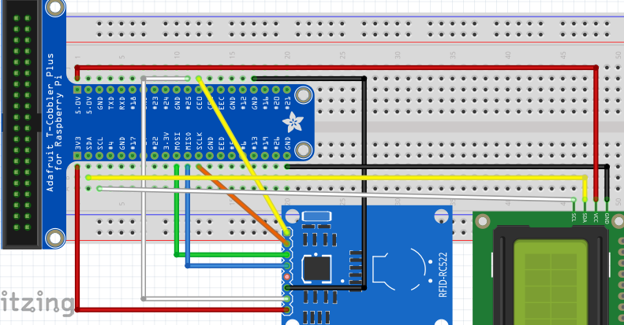
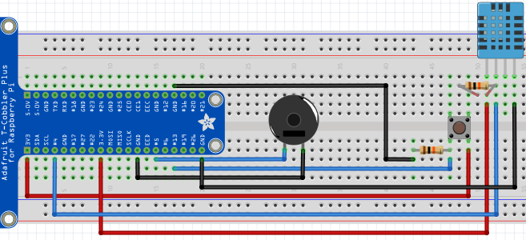
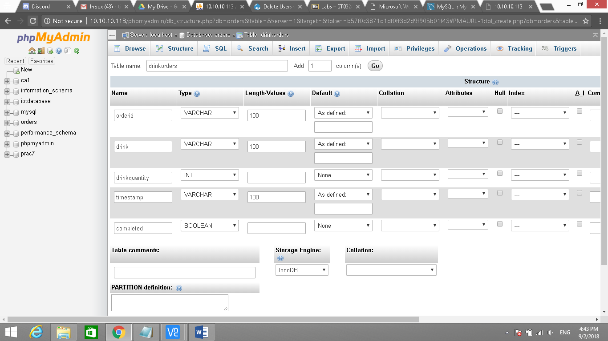
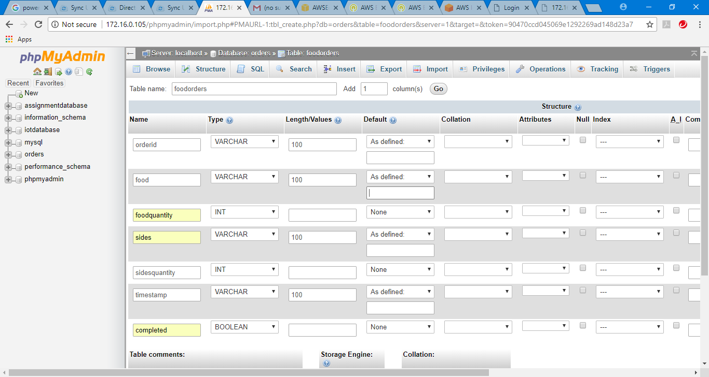

# FNC
This application is based on a fast food restaurant scenario which serves as food ordering system. Customers are able to place their orders on a web application and the orders will be displayed on separate web pages based on the food and drink topics. This application will require three Raspberry Pis. The first Raspberry Pi will run as the client facing web application for users to place orders. The second Raspberry Pi will display food orders while the third Raspberry Pi will display drink orders.

This application also has a fire detection system to alert personnels of the temperature situation in the kitchen or drink station through email and the sound of buzzers.

## Prerequisites
You will need a AWS Cloud account as well as 3 Raspberry Pi including a RFID reader, 2 buzzers, 2 temperature sensors, 2 buttons and 1 LCD display. The fritzing diagrams for the first, second and third Raspberry Pi are shown below.
### First Raspberry Pi (To serve users)

### Second and Third Raspberry Pi (To serve kitchen)

## Configurations
You will need to create 7 tables in DynamoDB. They are food, drinks, sides, users, orders, foodpreparationtime and drinkpreparationtime. The food, drinks and sides table will have id as the primary key. The users table will have username as the primary key. The orders table will have timestamp as the primary key. The table food, drinks and sides is to store the description of each of the item. The users table is used to store the username and hashed password of the admin. The orders table is used to store all the orders placed. The foodpreparationtime and drinkpreparationtime table will have timestamp as the primary key and would be used to store the time taken to complete the food/drink order. Note that you would need to run the `aws configure` command and enter your credentials. 

You will also need to create an IOT Rule to insert the orders sent by MQTT to the orders table in DynamoDB. Also, you will need to create 1 more IOT rule to send the email in the event of fire. A lambda function is also required to split the order to the kitchen and drink station. The function is shown in `lamdafunction.py`.

You will also need to create a table in the local MySQL of 2 Raspberry Pi. It will be used to store the details of the orders sent to the food and drink station. The details are shown in the screenshots below.

There are mainly 5 python scripts.  
`adminserver.py` - Used to manage the admin webpage. It is connected to the DynamoDB database to authenticate admin credentials, show graph of profit, number of orders and table for order history. It also subscribes to MQTT topics, to display the temperature of the kitchen and the drink station as well as the fire alarm status. 
`collection.py` - To run the flask server to let users know the current orderid being served. 
`drinkclient.py` - For drink station staff to view drink orders that are subscribed to the MQTT topics which is inserted into the local MySQL database. It also allows the staff to remove the order once completed and also to sends the temperature of the station. 
`firestation.py` - To run the flask server and subscribe to MQTT topics to let the staff at the fire station to view the temperature of the kitchen and drink station. 
`foodclient.py` - For kitchen staff to view drink orders that are subscribed to the MQTT topics which is inserted into the local MySQL database. It also allows the staff to remove the order once completed and also to sends the temperature of the station. 
`sessionwebserver.py` - To run the flask server to let users to order their food. It would then publish the orders to MQTT topics. It also connects to DynamoDB to retrieve data such as the food items and also to send orders once the payment is received from the nfc card reader.
